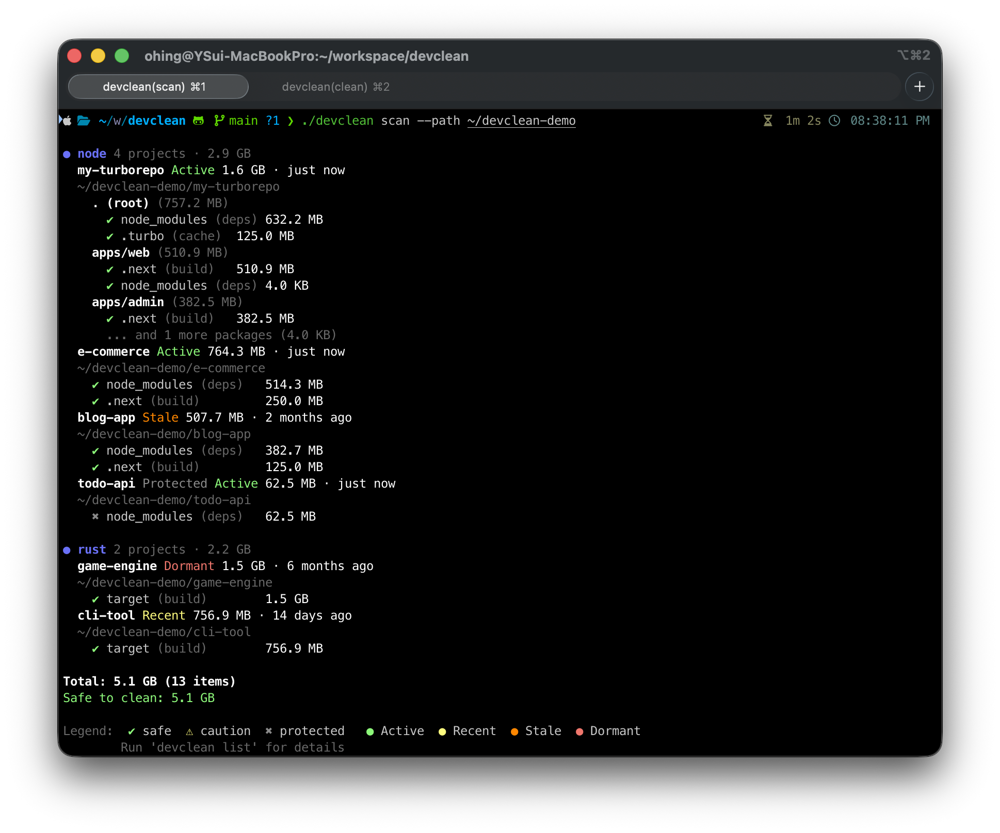
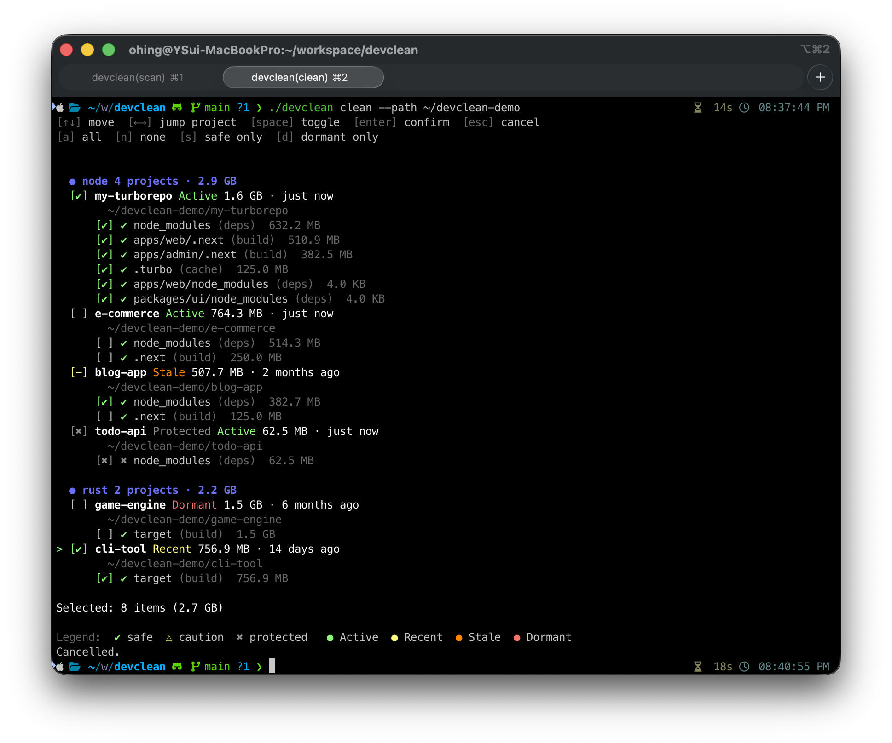

# devclean

Developer disk cleanup CLI — scan and clean build artifacts, caches, dependencies, and runtimes across multiple ecosystems.

## Screenshots

### Scan



### Clean (Interactive Tree Selector)



## Supported Ecosystems

| Ecosystem | Detection | Artifacts | Status |
|-----------|-----------|-----------|--------|
| **Node.js** | `package.json` | `node_modules`, `.next`, `.nuxt`, `dist`, `.turbo`, `.parcel-cache`, `.svelte-kit`, `coverage` | ✅ |
| **Node.js + React Native / Expo** | `ios/Podfile` or `metro.config.{js,ts,cjs,mjs}` | adds `ios/Pods`, `ios/build`, `ios/DerivedData`, `android/build`, `android/.gradle`, `.expo`, `.metro` | ✅ |
| **Rust** | `Cargo.toml` | `target` | ✅ |
| **Ruby** | `Gemfile` | `vendor/bundle`, `.bundle`, `tmp`, `log`, `coverage`, `.ruby-lsp` | ✅ |
| **Python** | `pyproject.toml`, `setup.py`, `setup.cfg`, `requirements.txt`, `Pipfile`, `uv.lock` | `__pycache__`, `.pytest_cache`, `.mypy_cache`, `.ruff_cache`, `.tox`, `.nox`, `.ipynb_checkpoints`, `__pypackages__`, `*.egg-info`, `.venv` / `venv` (caution) | ✅ |
| **Go** | `go.mod` | `vendor` (caution; per-project only — global caches handled by upcoming `global` scanner) | ✅ |
| **iOS/Xcode** (macOS only) | fixed `~/Library/Developer/...` paths | `DerivedData`, `Archives`, `iOS/watchOS/tvOS DeviceSupport`, `CoreSimulator/Devices`, simulator runtimes | ✅ |
| Android | | | planned |
| Flutter | | | planned |
| Docker | | | planned |
| Global caches | | | planned |

See [Ecosystems](docs/ecosystems.md) for full detection and safety details.

## Features

- Scan for reclaimable disk space across Node.js (incl. React Native / Expo), Rust, Ruby, Python, Go, iOS/Xcode, and more
- Monorepo support — artifacts grouped by git root with sub-package breakdown
- Activity classification — active, recent, stale, dormant (based on git + filesystem)
- Gitignore-aware protection — only git-tracked artifacts are protected
- `--min-size` filter to suppress small artifacts and focus on real targets
- Interactive tree selector for clean — select by project or individual artifact
- Soft delete (Trash) by default, with force delete option
- Vendor-native cleanup hooks (`xcrun simctl delete unavailable`, etc.) via `--vendor-cleanup`
- JSON output for scripting and AI agent integration
- Colored terminal output with ecosystem grouping

## Install

```bash
# Go (recommended for now — Go 1.26+)
go install github.com/ohing504/devclean/cmd/devclean@latest

# From source
git clone https://github.com/ohing504/devclean.git
cd devclean
go build -o devclean ./cmd/devclean
```

> Pre-built binaries (macOS / Linux) and a Homebrew formula are planned for the
> first tagged release. Until then, please use `go install` or build from source.

## Usage

```bash
# Scan for reclaimable space
devclean scan
devclean scan --path ~/workspace
devclean scan --eco node,rust
devclean scan --status dormant -n 10
devclean scan --json

# Clean up (interactive)
devclean clean --eco node
devclean clean --eco node --status dormant

# Clean up (non-interactive)
devclean clean --eco node --status dormant --yes
devclean clean --safe --dry-run --yes

# Utilities
devclean list
```

## Documentation

- [Architecture](docs/architecture.md) — system design and scanner patterns
- [CLI Commands](docs/commands.md) — full command reference with examples
- [Ecosystems](docs/ecosystems.md) — supported ecosystems, detection patterns, and safety levels
- [Configuration](docs/configuration.md) — settings file spec and options

## Contributing

PRs welcome — see [CONTRIBUTING.md](CONTRIBUTING.md) for build, test, and PR
guidelines, plus a walkthrough for adding a new ecosystem scanner.

## License

[MIT](LICENSE) — © 2026 Youngsup Oh
