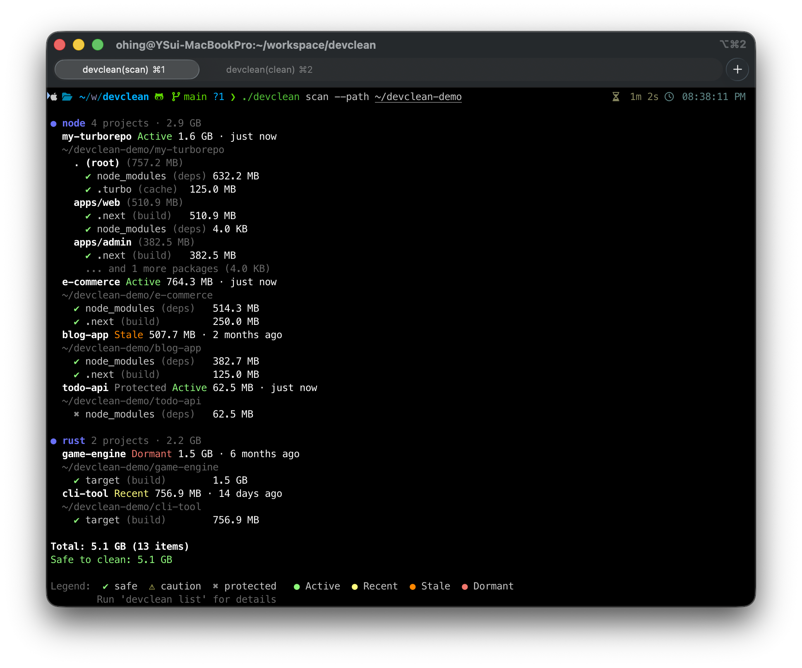
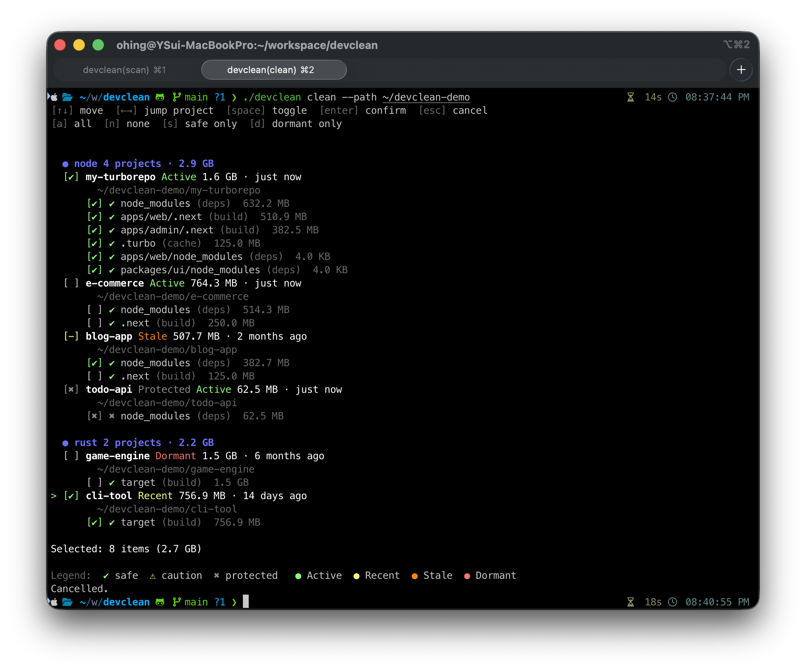

# devclean

Developer disk cleanup CLI — scan and clean build artifacts, caches, dependencies, and runtimes across multiple ecosystems.

## Screenshots

### Scan



### Clean (Interactive Tree Selector)



## Install

```bash
# Go (Go 1.26+)
go install github.com/ohing504/devclean/cmd/devclean@latest

# Pre-built binary (macOS / Linux, amd64 / arm64)
# Download a tarball from the latest release and put `devclean` on your PATH:
# https://github.com/ohing504/devclean/releases/latest

# From source
git clone https://github.com/ohing504/devclean.git
cd devclean
go build -o devclean ./cmd/devclean
```

> A Homebrew formula is planned for a later release. Until then, use one of the
> options above.

## Usage and documentation

- [Spec](docs/SPEC.md) — commands and flags, safety levels, supported ecosystems, configuration
- [Changelog](CHANGELOG.md) — release notes and version history

## Contributing

See [CONTRIBUTING.md](CONTRIBUTING.md).

## License

[MIT](LICENSE) — © 2026 Youngsup Oh
